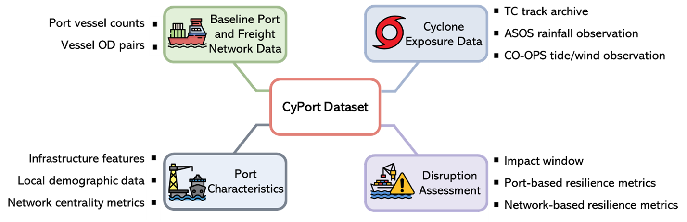
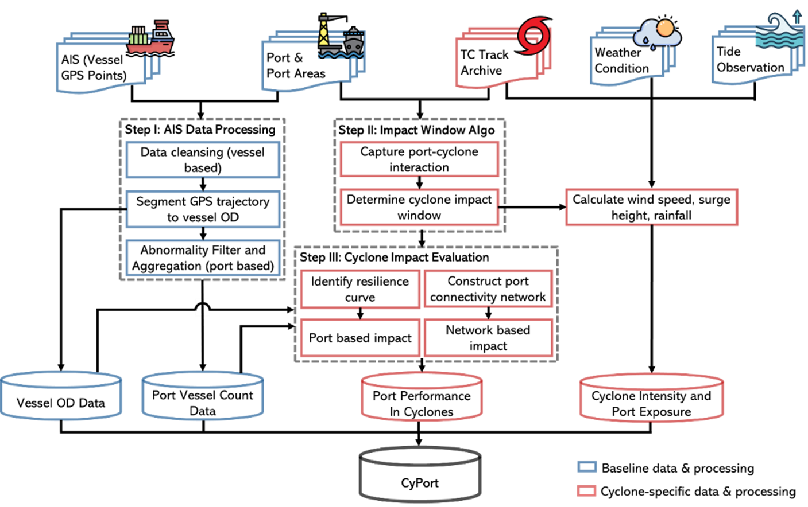

# CyPort: A Unified Dataset for Port Disruption Analysis under Tropical Cyclones

[](https://CyPort-dataset.users.earthengine.app/view/cyport)

**CyPort** is a comprehensive, long-time-span dataset designed to support the analysis of port–cyclone interactions and freight network resilience. It integrates port operations, vessel trajectories, tropical cyclone exposures, meteorological conditions, and network-based disruption assessments.

---

## 🔗 Access

- **Dataset Repository**: [https://github.com/ChenchenMobility/CYPORT.git](https://github.com/ChenchenMobility/CYPORT.git)  
- **Interactive GEE App**: [CyPort Google Earth Engine Viewer](https://CyPort-dataset.users.earthengine.app/view/cyport)

---

## 📦 Dataset Overview

CyPort includes two core components:

1. **Baseline Port and Freight Data (2015–2023)**  
   - Daily vessel counts at principal U.S. ports  
   - 745,704 commercial vessel OD trajectories  
   - Port-level trade attributes and infrastructure indicators

2. **Port–Cyclone Interaction Records (1,927 total)**  
   - Exposure conditions (cyclone intensity, distance, duration)  
   - Observed weather and tide data  
   - Port-specific disruption responses  
   - Resilience and network centrality metrics

---



> **Figure 1**: Four main data blocks—baseline port activity, cyclone exposures, disruption assessments, and static port characteristics—form the CyPort dataset.

---

## 🧭 Dataset Structure



> **Figure 2**: End-to-end data compilation process showing the flow from raw AIS/cyclone/meteorological sources into structured disruption records and derived resilience metrics.

---

## 📋 Data Sources

The table below summarizes key data types, descriptions, and sources:

> **Table 1**: CyPort Data Sources Description

| **Scope**            | **Data Types**                  | **Description**                                                                                     | **Sources**                                                                                                                                     |
|----------------------|----------------------------------|-----------------------------------------------------------------------------------------------------|--------------------------------------------------------------------------------------------------------------------------------------------------|
| **Baseline Data**     | Port Daily Vessel Counts         | Daily commercial vessel counts for U.S. principal ports from 2015 to 2023                           | AIS Data (Marine Cadastre., 2024)                                                                                                               |
|                      | Vessel Trajectories (Port Calls) | Sequential port call records for all commercial vessels (cargo and tanker)                          | AIS Data (Marine Cadastre., 2024)                                                                                                               |
|                      | Port Characteristics             | Includes port statistical areas, trade attributes for 145 principal U.S. ports, local census data, and infrastructure | USAGE (2021); USDOT BTS (2022); U.S. Census (2021); CEJST (2022); OpenStreetMap (2024)                         |
| **Cyclone-period Data** | Cyclone Records                  | Tropical cyclone intensity, distance to port, and exposure time window                               | IBTrACS (NOAA, 2024a)                                                                                                                            |
|                      | Meteorological Data              | Water level, storm surge height, rainfall, and wind speed during TCs, from nearest gauges and stations | CO-OPS (2024); ASOS (NOAA, 2024b)                                                                                                                |
|                      | Port Network Centralities        | Port’s degree, betweenness, and closeness centrality in recent weekly freight networks               | -                                                                                                                                                |
|                      | Resilience Metrics               | Metrics based on resilience curves and complex network features                                      | -                                                                                                                                                |
---

## 📖 Citation

If you find this work or dataset helpful, please cite:

> Kuai, C., Li, Z., Zhang, Y., Wang, X. B., Lord, D., & Zhou, Y. _U.S. port disruptions under tropical cyclones: Resilience analysis by harnessing multiple-source dataset._ Transportation Research Part D: Transport and Environment, 157, 105420, 2026. https://doi.org/10.1016/j.trd.2026.105420

BibTeX:

```bibtex
@article{kuai2026usportdisruptions,
  title = {U.S. port disruptions under tropical cyclones: Resilience analysis by harnessing multiple-source dataset},
  author = {Kuai, Chenchen and Li, Zihao and Zhang, Yunlong and Wang, Xiubin Bruce and Lord, Dominique and Zhou, Yang},
  journal = {Transportation Research Part D: Transport and Environment},
  volume = {157},
  pages = {105420},
  year = {2026},
  doi = {10.1016/j.trd.2026.105420},
  url = {https://doi.org/10.1016/j.trd.2026.105420}
}
```

---

## 📬 Contact

For questions, please reach out via GitHub issues or contact the dataset author directly.

---

## 📄 License

This dataset is released under the [Creative Commons Attribution 4.0 International License](https://creativecommons.org/licenses/by/4.0/).
