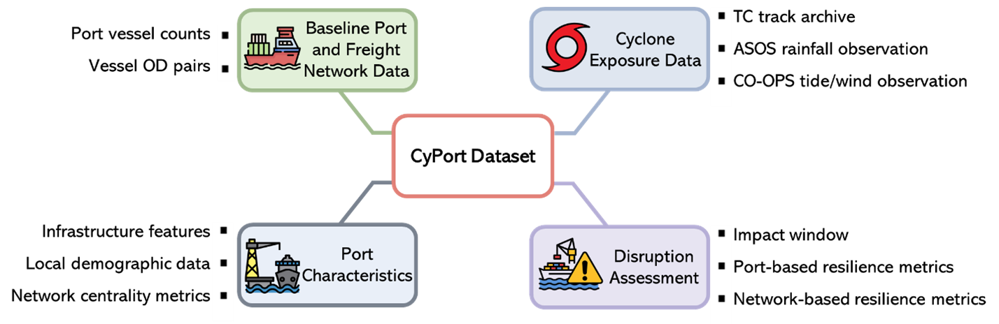

# CyPort: A Unified Dataset for Port Disruption Analysis under Tropical Cyclones

**CyPort** is a comprehensive, multimodal dataset designed to support the analysis of port–cyclone interactions and freight network resilience. It integrates port operations, vessel trajectories, tropical cyclone exposures, meteorological conditions, and network-based disruption assessments.

---

## 🔗 Access

- **Dataset Repository**: [https://github.com/ChenchenMobility/CYPORT.git](https://github.com/ChenchenMobility/CYPORT.git)  
- **Interactive GEE App**: [CyPort Google Earth Engine Viewer](https://CyPort-dataset.users.earthengine.app/view/cyport)

---

## 📦 Dataset Overview

CyPort includes two core components:

1. **Baseline Port and Freight Data (2015–2023)**  
   - Daily vessel counts at principal U.S. ports  
   - 745,704 commercial vessel OD trajectories  
   - Port-level trade attributes and infrastructure indicators

2. **Port–Cyclone Interaction Records (1,927 total)**  
   - Exposure conditions (cyclone intensity, distance, duration)  
   - Observed weather and tide data  
   - Port-specific disruption responses  
   - Resilience and network centrality metrics

---

## 🧭 Dataset Structure

> **Figure 1**: Four main data blocks—baseline port activity, cyclone exposures, disruption assessments, and static port characteristics—form the CyPort dataset.

---

> **Figure 2**: End-to-end data compilation process showing the flow from raw AIS/cyclone/meteorological sources into structured disruption records and derived resilience metrics.

---

## 📋 Data Description

The table below summarizes key data types, descriptions, and sources:

> **Table A-1**: Description of CyPort data sources and variables, including AIS-based port calls, meteorological observations during cyclones, and resilience-related metrics.

---

## 📖 Citation

Please cite the forthcoming paper when using the dataset:

> Kuai, C., et al. _"U.S. Port Disruptions under Tropical Cyclones: Multi-Source Dataset and Resilience Analysis."_ (Under Review, 2025).

---

## 📬 Contact

For questions, please reach out via GitHub issues or contact the dataset author directly.

---

## 📄 License

This dataset is released under the [Creative Commons Attribution 4.0 International License](https://creativecommons.org/licenses/by/4.0/).
